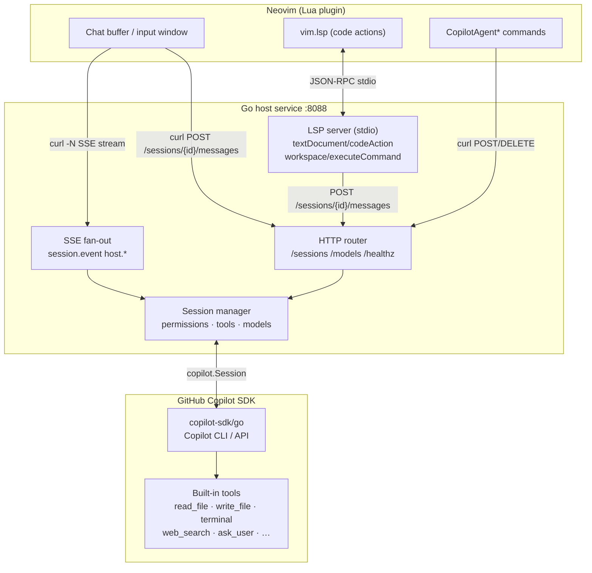

# copilot-agent.nvim

A Neovim plugin that bridges the [GitHub Copilot SDK](https://github.com/github/copilot-sdk) to Neovim via a lightweight Go HTTP service. Persistent sessions, streamed responses, LSP code actions, and a rich input buffer — all without a heavy Lua HTTP dependency.

---

## Architecture



The Go binary runs a **single process** that serves both the HTTP bridge (sessions, SSE, user-input, permissions) and an LSP server on stdio. Neovim starts it as an LSP client (`vim.lsp.start`), which owns the process lifetime. The Lua plugin communicates via `curl` shell-outs for all HTTP and SSE traffic.

---

## Comparison with Alternatives

### vs CopilotChat.nvim

[CopilotChat.nvim](https://github.com/CopilotC-Nvim/CopilotChat.nvim) calls the Copilot (or other) LLM REST APIs directly from Lua. It supports multiple providers but has no agent runtime of its own — tool execution and the agentic loop are implemented in Lua above the client.

| Feature                   | **copilot-agent.nvim**                                | CopilotChat.nvim          |
| ------------------------- | ----------------------------------------------------- | ------------------------- |
| Backend                   | Official Copilot SDK (Go)                             | Direct LLM REST API (Lua) |
| Agent / tool-use mode     | ✅ full agentic (file edits, terminal, web search, …) | ❌ chat only              |
| Chat modes                | ask · plan · **agent**                                | ask only                  |
| Permission management     | ✅ interactive / approve-all / autopilot / reject-all | ❌                        |
| File & folder attachments | ✅ (buffer, selection, path, instructions)            | ✅ (buffer context)       |
| Session persistence       | ✅ per working directory                              | ❌                        |
| Model switching (live)    | ✅ mid-session with tab-complete                      | ✅                        |
| LSP code actions          | ✅ (explain / fix / add tests / add docs)             | ❌                        |
| ACP / MCP support         | ❌                                                    | ❌                        |
| Custom agents / skills    | ✅                                                    | ❌                        |
| SSE streaming             | ✅ native                                             | ✅                        |
| Multi-provider            | ❌ (Copilot only)                                     | ✅ (provider_resolver)    |
| Dependencies              | Go 1.24 + curl                                        | Pure Lua (plenary)        |

**When to choose CopilotChat.nvim**: zero-binary Lua setup, just want Copilot chat with buffer context, happy with a Lua-managed tool loop.

**When to choose copilot-agent.nvim**: you want the Copilot SDK owning the agent loop with native tools, permission control, and session persistence.

---

### vs ACP plugins (codecompanion.nvim, avante.nvim)

[**ACP (Agent Client Protocol)**](https://agentclientprotocol.com) is an open protocol that lets a Neovim plugin act as a client to any external CLI agent — Claude Code, Copilot CLI, Codex, Gemini CLI, Goose, and more. The plugin sends prompts and streams back results; the CLI agent owns the tool execution and agentic loop. Both codecompanion.nvim and avante.nvim support ACP, giving them access to the full capability of whichever CLI agent you point them at.

Beyond ACP, these plugins also support direct LLM API calls (multi-provider adapters) and MCP (Model Context Protocol) tool servers, making them highly general-purpose.

`copilot-agent.nvim` is narrower in scope but deeper in Copilot integration: the Go service embeds the Copilot SDK directly, so it gets SDK-native features (config discovery, custom agents, skill directories, sub-agent streaming) that no ACP bridge can expose.

| Feature                      | **copilot-agent.nvim**                                      | codecompanion.nvim                        | avante.nvim                            |
| ---------------------------- | ----------------------------------------------------------- | ----------------------------------------- | -------------------------------------- |
| Agent backend                | Copilot SDK (Go, embedded)                                  | ACP CLI agents or direct LLM adapters     | ACP CLI agents or direct LLM adapters  |
| ACP support                  | ❌                                                          | ✅ (Claude Code, Codex, Copilot CLI, …)   | ✅ (Zen Mode)                          |
| MCP support                  | ❌                                                          | ✅                                        | ✅                                     |
| Multi-provider / BYO API key | ❌ (Copilot only)                                           | ✅ (Anthropic, OpenAI, Gemini, Ollama, …) | ✅ (Claude, OpenAI, Gemini, Ollama, …) |
| Tool-call execution          | SDK built-ins (file I/O, terminal, web search, ask_user, …) | Lua tools + ACP agent tools               | Rust tools + ACP agent tools           |
| Sub-agent / streaming events | ✅ SDK-native                                               | ❌                                        | ❌                                     |
| Custom agents / skill dirs   | ✅                                                          | ❌                                        | ❌                                     |
| Config discovery             | ✅ (`.github/copilot-instructions.md`, etc.)                | ✅ (`CLAUDE.md`, `.cursor/rules`, custom) | ✅ (`avante.md`)                       |
| Permission management        | ✅ interactive / approve-all / autopilot / reject-all       | ❌                                        | ❌                                     |
| Session persistence          | ✅ per working directory                                    | ❌                                        | ❌                                     |
| LSP code actions             | ✅ (explain / fix / add tests / add docs)                   | ✅ (via prompt library)                   | ❌                                     |
| Chat modes                   | ask · plan · agent                                          | chat · inline · workflow                  | ask · edit (Cursor-style)              |
| External binary required     | Go binary                                                   | Pure Lua (plenary + treesitter)           | Rust binary (compiled at install)      |
| GitHub Copilot subscription  | Required                                                    | Optional (one of many providers)          | Optional (one of many providers)       |
| Community / ecosystem        | Smaller                                                     | Large (adapters, prompts, extensions)     | Large (star count, active development) |

**When to choose codecompanion / avante**: you want model flexibility, ACP access to Claude Code / Codex / Gemini CLI, MCP tool servers, or a large community ecosystem — and you're not exclusively on GitHub Copilot.

**When to choose copilot-agent.nvim**: you're committed to GitHub Copilot and want the deepest possible SDK integration — native tools, permission management, session persistence, sub-agent events, and LSP code actions — without routing through an intermediate CLI.

---

## Prerequisites

- Go 1.24+
- `curl` on `PATH`
- GitHub Copilot CLI runtime (`@github/copilot/index.js`) or access via `-cli-url`
- Neovim 0.10+ (0.12 recommended for `nvim_open_win` split API)

---

## Installation

### lazy.nvim

```lua
{
  "ray-x/copilot-agent.nvim",
  config = function()
    require("copilot_agent").setup({
      base_url = "http://127.0.0.1:8088",
      client_name = "nvim-copilot",
      permission_mode = "interactive",  -- or "approve-all" / "autopilot"
      session = {
        working_directory = function() return vim.fn.getcwd() end,
        model = nil,    -- nil = Copilot picks a default
        streaming = true,
        enable_config_discovery = true,
      },
      service = {
        auto_start = true,
        command = { "go", "run", "." },   -- or { "/path/to/copilot-agent" }
        cwd = nil,                         -- defaults to <plugin_root>/server
        startup_timeout_ms = 15000,
      },
      chat = {
        title = "Copilot Chat",
        system_notify_timeout = 3000,      -- ms before auto-clearing transient notices
      },
    })
    -- Start the combined HTTP + LSP service.
    -- Called automatically by CopilotAgentChat / CopilotAgentAsk if auto_start = true.
    -- Call explicitly to get LSP code actions:
    require("copilot_agent").start_lsp()
  end,
}
```

If you've built the binary separately:

```lua
service = { auto_start = true, command = { "/path/to/copilot-agent", "--addr", "127.0.0.1:8088" } }
```

---

## Running the Service Manually

```bash
cd server/

# Development (builds on the fly)
go run .

# With explicit options
go run . \
  -addr 127.0.0.1:8088 \
  -cwd /path/to/workspace \
  -cli-path /path/to/@github/copilot/index.js \
  -lsp=true      # default: true — LSP server on stdio

# Build a binary first
go build -o copilot-agent .
./copilot-agent -addr 127.0.0.1:8088
```

**Flags:**

| Flag         | Default       | Description                                  |
| ------------ | ------------- | -------------------------------------------- |
| `-addr`      | `:8088`       | HTTP listen address                          |
| `-cwd`       | current dir   | Default working directory for sessions       |
| `-model`     | (sdk default) | Default model for new sessions               |
| `-cli-path`  | auto-detected | Path to Copilot CLI binary/JS entrypoint     |
| `-cli-url`   | —             | URL of an already-running Copilot CLI server |
| `-log-level` | —             | Copilot CLI log level                        |
| `-lsp`       | `true`        | Start LSP server on stdio                    |

---

## Commands

| Command                     | Description                                                |
| --------------------------- | ---------------------------------------------------------- |
| `:CopilotAgentChat`         | Open the chat buffer (creates session if needed)           |
| `:CopilotAgentAsk [prompt]` | Send a prompt; no argument opens `vim.ui.input()`          |
| `:CopilotAgentNewSession`   | Disconnect current session and start a fresh one           |
| `:CopilotAgentModel [id]`   | Pick or set a model; tab-completes from service model list |
| `:CopilotAgentStart`        | Manually start the Go service                              |
| `:CopilotAgentStop`         | Disconnect the active session                              |
| `:CopilotAgentStop!`        | Disconnect and delete persisted session state              |
| `:CopilotAgentStatus`       | Show service URL, session id, stream status                |
| `:CopilotAgentLsp`          | Start (or reuse) the LSP client for code actions           |

---

## Input Buffer

Open with `:CopilotAgentChat`, then press `i` or `<Enter>` in the chat buffer.

### Keybindings

| Key               | Action                                                                         |
| ----------------- | ------------------------------------------------------------------------------ |
| `<CR>` / `<C-s>`  | Send message                                                                   |
| `q` / `<Esc>`     | Close input (normal mode)                                                      |
| `<C-t>`           | Cycle chat mode: **ask → plan → agent**                                        |
| `<M-m>`           | Open model picker                                                              |
| `<M-a>`           | Cycle permission mode: **🔐 interactive → ✅ approve-all → 🤖 autopilot**      |
| `<C-a>`           | Attach resource (current buffer, visual selection, file, folder, instructions) |
| `<C-x>`           | Toggle session tools (enable/disable individual tools)                         |
| `<Tab>`           | Trigger completion (`@file` or `/slash-command`)                               |
| `@<path>`         | Attach a file by path (autocomplete from working directory)                    |
| `/<cmd>`          | Slash command (autocomplete from 50+ supported commands)                       |
| `<C-p>` / `<M-p>` | Previous prompt from history                                                   |
| `<C-n>` / `<M-n>` | Next prompt from history                                                       |
| `?` (normal)      | Show help float                                                                |

### Chat Modes

The mode is shown in the statusline prefix (e.g. `ask❯`):

- **ask** — Standard Q&A
- **plan** — Ask Copilot to create an implementation plan
- **agent** — Autonomous agent mode (runs tools, edits files)

### Permission Modes

Cycled with `<M-a>`:

- 🔐 **interactive** — Neovim prompts `Allow / Deny` for each tool use
- ✅ **approve-all** — Auto-approve all tool uses silently
- 🤖 **autopilot** — Auto-approve tools + auto-answer any user-input requests

---

## LSP Code Actions

The Go binary runs an LSP server on stdio. Start it with `:CopilotAgentLsp` or `require("copilot_agent").start_lsp()`.

Available code actions (triggered on any selection via `vim.lsp.buf.code_action()`):

- **Explain selection** — Ask Copilot to explain the selected code
- **Fix selection** — Ask Copilot to suggest a fix
- **Add tests for selection** — Generate unit tests
- **Add docs for selection** — Generate documentation

The action builds a prompt from the selected text, file path, and line range, then POSTs it to the active HTTP session.

---

## Statusline API

Expose Copilot state in your statusline. Each function returns a short string.

```lua
-- lualine
require("lualine").setup {
  sections = {
    lualine_x = {
      require("copilot_agent").statusline_mode,        -- [ask] / [plan] / [agent]
      require("copilot_agent").statusline_model,       -- claude-sonnet-4.6 / default
      require("copilot_agent").statusline_busy,        -- ✓ or ⏳
      require("copilot_agent").statusline_permission,  -- 🔐interactive / ✅approve-all / 🤖autopilot
      require("copilot_agent").statusline_attachments, -- 📎3 (when attachments pending)
    }
  }
}

-- heirline / &statusline
-- %{v:lua.require'copilot_agent'.statusline()}
```

---

## Session Persistence

Sessions are scoped per project: `pick_or_create_session` filters persisted sessions by working directory, so opening a different project starts a fresh session. Use `:CopilotAgentNewSession` to force a new one in the same directory.

---

## HTTP API Reference

| Method   | Path                                | Description                                            |
| -------- | ----------------------------------- | ------------------------------------------------------ |
| `GET`    | `/healthz`                          | Health check                                           |
| `GET`    | `/sessions`                         | List all sessions (live + persisted)                   |
| `POST`   | `/sessions`                         | Create or resume a session                             |
| `GET`    | `/sessions/{id}`                    | Get live session metadata                              |
| `DELETE` | `/sessions/{id}`                    | Disconnect; `?delete=true` removes persisted state     |
| `GET`    | `/sessions/{id}/messages`           | Fetch stored session events                            |
| `POST`   | `/sessions/{id}/messages`           | Send a prompt with optional attachments                |
| `GET`    | `/sessions/{id}/events`             | SSE stream of session + host events                    |
| `POST`   | `/sessions/{id}/user-input/{reqID}` | Answer a pending `ask_user` request                    |
| `POST`   | `/sessions/{id}/permission/{reqID}` | Answer a pending permission request (interactive mode) |
| `POST`   | `/sessions/{id}/permission-mode`    | Update permission mode on a live session               |
| `POST`   | `/sessions/{id}/model`              | Switch model for a live session                        |
| `POST`   | `/sessions/{id}/tools`              | Update excluded tools list                             |
| `GET`    | `/models`                           | List available models                                  |

### Permission modes for `POST /sessions`

```json
{ "permissionMode": "interactive" }   // prompt Neovim UI per tool use
{ "permissionMode": "approve-all" }   // auto-approve everything
{ "permissionMode": "autopilot" }     // approve-all + auto-answer user inputs
{ "permissionMode": "reject-all" }    // reject all tool uses
```

### SSE Event Types

| Event                          | Description                                                                       |
| ------------------------------ | --------------------------------------------------------------------------------- |
| `session.event`                | Raw SDK events (`assistant.message_delta`, `assistant.turn_end`, etc.)            |
| `host.user_input_requested`    | Agent needs user input — reply via `POST .../user-input/{id}`                     |
| `host.permission_requested`    | Tool use needs approval (interactive mode) — reply via `POST .../permission/{id}` |
| `host.permission_decision`     | Logged approval/rejection outcome                                                 |
| `host.permission_mode_changed` | Permission mode updated on live session                                           |
| `host.model_changed`           | Model switched on live session                                                    |
| `host.session_disconnected`    | Session was closed                                                                |
| `: keepalive`                  | SSE keepalive comment (ignore)                                                    |

---

## Quick Start Example

```bash
# Terminal 1: start the service
go run ./server -addr 127.0.0.1:8088 -cli-path ~/.local/share/github-copilot/index.js

# Terminal 2: create a session
curl -s -X POST http://127.0.0.1:8088/sessions \
  -H 'Content-Type: application/json' \
  -d '{"workingDirectory":".","permissionMode":"approve-all","clientName":"test"}'

# Stream events (replace SESSION_ID)
curl -N http://127.0.0.1:8088/sessions/SESSION_ID/events

# Send a message
curl -X POST http://127.0.0.1:8088/sessions/SESSION_ID/messages \
  -H 'Content-Type: application/json' \
  -d '{"prompt":"Explain what this project does."}'
```
