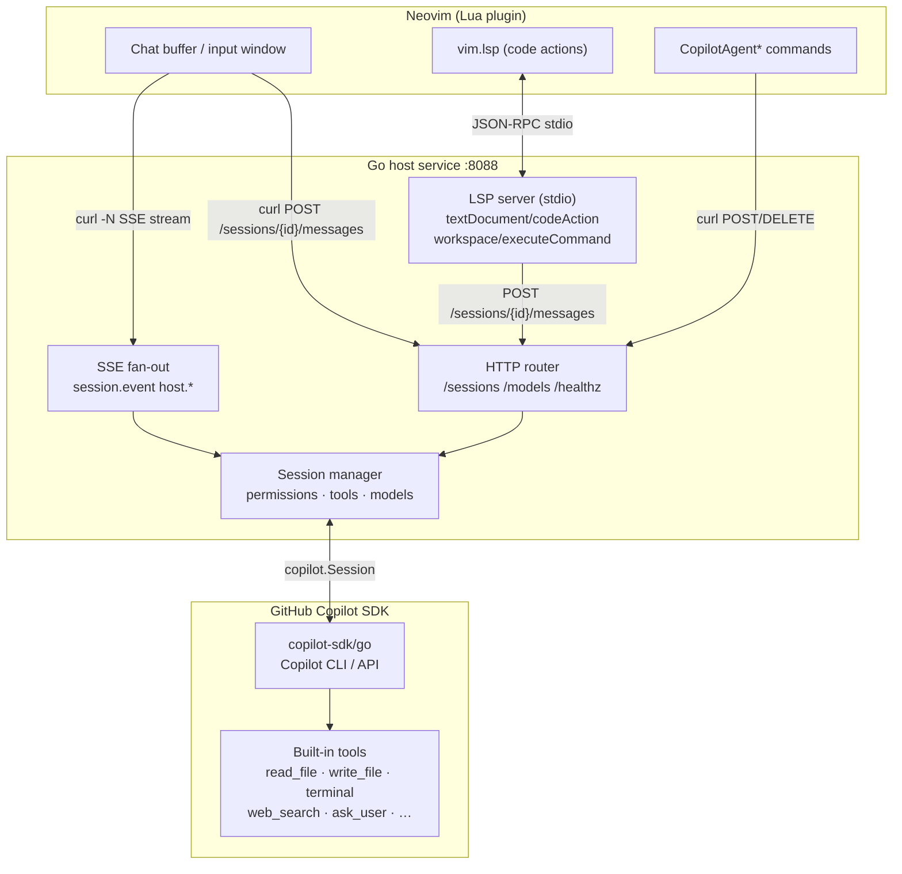

# copilot-agent.nvim

A Neovim plugin that bridges the [GitHub Copilot SDK](https://github.com/github/copilot-sdk) to Neovim via a lightweight Go HTTP service. Persistent sessions, streamed responses, LSP code actions, and a rich input buffer with SSE/HTTP.

## Cool features

- Full agentic tool execution (file read/write, terminal, web search, ask user)
- Granular permission management (interactive, approve-all, reject-all, autopilot)
- Sub-agent streaming event
- Custom agents and skill directories. Fully compatible with vscode copilot chat setup
- LSP code actions

---

## Architecture



The Go binary runs a **single process** that serves both the HTTP bridge (sessions, SSE, user-input, permissions) and an LSP server on stdio. Neovim starts it as an LSP client (`vim.lsp.start`), which owns the process lifetime. The Lua plugin communicates via `curl` shell-outs for all HTTP and SSE traffic.

**Why curl?** Neovim has no built-in HTTP client. `vim.uv` (libuv) exposes raw TCP sockets but requires a manual HTTP/1.1 implementation — headers, chunked encoding, SSE framing. `curl` is universally available on macOS and Linux, handles SSE natively, and keeps the Lua layer thin and dependency-free. The per-request process-spawn overhead (~5–20 ms) is imperceptible against LLM response latency.

---

## Comparison with Alternatives

### vs CopilotChat.nvim

[CopilotChat.nvim](https://github.com/CopilotC-Nvim/CopilotChat.nvim) calls the Copilot (or other) LLM REST APIs directly from Lua. It supports multiple providers but has no agent runtime of its own — tool execution and the agentic loop are implemented in Lua above the client.

| Feature                   | **copilot-agent.nvim**                                | CopilotChat.nvim          |
| ------------------------- | ----------------------------------------------------- | ------------------------- |
| Backend                   | Official Copilot SDK (Go)                             | Direct LLM REST API (Lua) |
| Agent / tool-use mode     | ✅ full agentic (file edits, terminal, web search, …) | ❌ chat only              |
| Chat modes                | ask · plan · **agent**                                | ask only                  |
| Permission management     | ✅ interactive / approve-all / autopilot / reject-all | ❌                        |
| File & folder attachments | ✅ (buffer, selection, file, folder, image, clipboard paste) | ✅ (buffer context)       |
| Session persistence       | ✅ per working directory                              | ❌                        |
| Model switching (live)    | ✅ mid-session with tab-complete                      | ✅                        |
| LSP code actions          | ✅ (explain / fix / add tests / add docs)             | ❌                        |
| ACP / MCP support         | ❌                                                    | ❌                        |
| Custom agents / skills    | ✅                                                    | ❌                        |
| SSE streaming             | ✅ native                                             | ✅                        |
| Multi-provider            | ❌ (Copilot only, or Bring your own key)              | ✅ (provider_resolver)    |
| Dependencies              | Go 1.24 + curl                                        | Pure Lua (plenary)        |

**When to choose CopilotChat.nvim**: zero-binary Lua setup, just want Copilot chat with buffer context, happy with a Lua-managed tool loop.

**When to choose copilot-agent.nvim**: you want the Copilot SDK owning the agent loop with native tools, permission control, and session persistence.

---

### vs ACP plugins (codecompanion.nvim, avante.nvim in ACP mode)

[**ACP (Agent Client Protocol)**](https://agentclientprotocol.com) lets a Neovim plugin act as a client to any external CLI agent. it supported by Claude Code, Copilot CLI, Codex, Gemini CLI, Goose, and more. The plugin sends prompts and streams back results; the CLI agent owns the tool execution and agentic loop. Both codecompanion.nvim and avante.nvim support ACP, giving them access to the full capability of whichever CLI agent you point them at.

Beyond ACP, these plugins also support direct LLM API calls (multi-provider adapters) and MCP (Model Context Protocol) tool servers, making them highly general-purpose.

`copilot-agent.nvim` is narrower in scope but deeper in Copilot integration: the Go service embeds the Copilot SDK directly, so it gets SDK-native features (config discovery, custom agents, skill directories, sub-agent streaming) that no ACP bridge can expose.

| Feature                      | **copilot-agent.nvim**                                      | codecompanion.nvim                        | avante.nvim                            |
| ---------------------------- | ----------------------------------------------------------- | ----------------------------------------- | -------------------------------------- |
| Agent backend                | Copilot SDK (Go, embedded)                                  | ACP CLI agents or direct LLM adapters     | ACP CLI agents or direct LLM adapters  |
| ACP support                  | ❌                                                          | ✅ (Claude Code, Codex, Copilot CLI, …)   | ✅ (Zen Mode)                          |
| MCP support                  | ❌                                                          | ✅                                        | ✅                                     |
| Multi-provider / BYO API key | ❌ (Copilot only)                                           | ✅ (Anthropic, OpenAI, Gemini, Ollama, …) | ✅ (Claude, OpenAI, Gemini, Ollama, …) |
| Tool-call execution          | SDK built-ins (file I/O, terminal, web search, ask_user, …) | Lua tools + ACP agent tools               | Rust tools + ACP agent tools           |
| Sub-agent / streaming events | ✅ SDK-native                                               | ❌                                        | ❌                                     |
| Custom agents / skill dirs   | ✅                                                          | ❌                                        | ❌                                     |
| Config discovery             | ✅ (`.github/copilot-instructions.md`, etc.)                | ✅ (`CLAUDE.md`, `.cursor/rules`, custom) | ✅ (`avante.md`)                       |
| Permission management        | ✅ interactive / approve-all / autopilot / reject-all       | ❌                                        | ❌                                     |
| Session persistence          | ✅ per working directory                                    | ❌                                        | ❌                                     |
| LSP code actions             | ✅ (explain / fix / add tests / add docs)                   | ✅ (via prompt library)                   | ❌                                     |
| Chat modes                   | ask · plan · agent                                          | chat · inline · workflow                  | ask · edit (Cursor-style)              |
| External binary required     | Go binary                                                   | Pure Lua (plenary + treesitter)           | Rust binary (compiled at install)      |
| GitHub Copilot subscription  | Required                                                    | Optional (one of many providers)          | Optional (one of many providers)       |
| Community / ecosystem        | Smaller                                                     | Large (adapters, prompts, extensions)     | Large (star count, active development) |

**When to choose codecompanion / avante**: you want model flexibility, ACP access to Claude Code / Codex / Gemini CLI, MCP tool servers, or a large community ecosystem — and you're not exclusively on GitHub Copilot.

**When to choose copilot-agent.nvim**: you're committed to GitHub Copilot and want the deepest possible SDK integration — native tools, permission management, session persistence, sub-agent events, and LSP code actions — without routing through an intermediate CLI.

---

## Prerequisites

- Go 1.24+ (only for building from source; pre-built binary skips this)
- `curl` on `PATH`
- GitHub Copilot CLI runtime (`@github/copilot/index.js`) or access via `-cli-url`
- Neovim 0.11+ (0.12+ recommended)

Run `:checkhealth copilot_agent` after installation to verify all requirements.

---

## Installation

### Step 1 — Download the pre-built binary (recommended)

Run this command inside Neovim after installing the plugin:

```
:CopilotAgentInstall
```

This downloads the correct binary for your platform from the
[latest GitHub release](https://github.com/ray-x/copilot-agent.nvim/releases/tag/latest)
and saves it to `<plugin_root>/bin/copilot-agent` (or `copilot-agent.exe` on Windows).
No Go toolchain required.

Supported platforms:

| Platform | Binary |
|---|---|
| Linux x86_64 | `copilot-agent-linux-amd64` |
| Linux aarch64 | `copilot-agent-linux-arm64` |
| Windows x86_64 | `copilot-agent-windows-amd64.exe` |
| Windows aarch64 | `copilot-agent-windows-arm64.exe` |
| macOS Apple Silicon | `copilot-agent-darwin-arm64` |

You can also download manually from the
[releases page](https://github.com/ray-x/copilot-agent.nvim/releases/tag/latest)
and place it anywhere; then set `service.command = { "/path/to/copilot-agent" }`.

### Step 2 — Plugin setup with lazy.nvim

```lua
{
  "ray-x/copilot-agent.nvim",
  config = function()
    require("copilot_agent").setup({
      -- When auto_start=true the plugin launches the Go service and reads its
      -- port from stderr automatically. No manual base_url needed.
      base_url = "http://127.0.0.1:8088",  -- only for externally-started services
      client_name = "nvim-copilot",
      permission_mode = "approve-all",  -- "interactive" | "approve-all" | "autopilot" | "reject-all"
      auto_create_session = true,
      session = {
        working_directory = function() return vim.fn.getcwd() end,
        model = nil,    -- nil = Copilot picks a default
        agent = nil,    -- nil = "default"; or "coding", "gpt-4.1", a custom agent name
        streaming = true,
        enable_config_discovery = true,  -- respects .github/copilot-instructions.md etc.
        auto_resume = "auto",  -- "auto" | "prompt" when multiple sessions exist
      },
      service = {
        auto_start = true,
        -- command = nil means auto: uses <plugin_root>/bin/copilot-agent if present,
        -- otherwise falls back to { "go", "run", "." } (requires Go toolchain).
        command = nil,
        cwd = nil,                         -- defaults to <plugin_root>/server
        port_range = nil,                  -- e.g. "18000-19000" for fixed range
        startup_timeout_ms = 15000,
        startup_poll_interval_ms = 250,
      },
      chat = {
        title = "Copilot Chat",
        system_notify_timeout = 3000,    -- ms before auto-clearing transient notices
        render_markdown = true,          -- set false to disable render-markdown.nvim (faster on long responses)
      },
      notify = true,  -- set false to silence all [copilot-agent] vim.notify calls
    })
    -- Start the combined HTTP + LSP service.
    -- Called automatically by CopilotAgentChat / CopilotAgentAsk if auto_start = true.
    -- Call explicitly here to get LSP code actions available immediately:
    require("copilot_agent").start_lsp()
  end,
}
```

If you want to point at a binary in a custom location:

```lua
-- Dynamic port (recommended for multiple nvim instances)
service = { auto_start = true, command = { "/path/to/copilot-agent" } }

-- Fixed port
service = { auto_start = true, command = { "/path/to/copilot-agent", "--addr", "127.0.0.1:8088" } }

-- Port range (first free port in 18000–19000)
service = { auto_start = true, command = { "/path/to/copilot-agent" }, port_range = "18000-19000" }
```

---

## Running the Service Manually

```bash
cd server/

# Development — OS assigns a free port; actual address printed to stderr
go run .

# Pin to a specific port (useful for curl testing)
go run . \
  -addr 127.0.0.1:8088 \
  -cwd /path/to/workspace \
  -cli-path /path/to/@github/copilot/index.js \
  -lsp=true      # default: true — LSP server on stdio

# Build a binary
go build -o copilot-agent .
./copilot-agent          # dynamic port
./copilot-agent -addr 127.0.0.1:8088   # fixed port
```

**Flags:**

| Flag            | Default       | Description                                             |
| --------------- | ------------- | ------------------------------------------------------- |
| `-addr`         | (free port)   | HTTP listen address; empty or `:0` → OS picks           |
| `-port-range`   | —             | Try ports lo–hi (e.g. `18000-19000`); first free wins   |
| `-cwd`          | current dir   | Default working directory for sessions                  |
| `-model`        | (sdk default) | Default model for new sessions                          |
| `-cli-path`     | auto-detected | Path to Copilot CLI binary/JS entrypoint                |
| `-cli-url`      | —             | URL of an already-running Copilot CLI server            |
| `-log-level`    | —             | Copilot CLI log level                                   |
| `-lsp`          | `true`        | Start LSP server on stdio                               |

The service always prints `COPILOT_AGENT_ADDR=127.0.0.1:<PORT>` to stderr once the
listener is bound. When `auto_start = true`, the plugin reads this line and
configures its HTTP client automatically — no manual `base_url` needed.

---

## Commands

| Command                     | Description                                                |
| --------------------------- | ---------------------------------------------------------- |
| `:CopilotAgentInstall`      | Download pre-built binary for the current platform         |
| `:CopilotAgentChat`         | Open the chat buffer (creates session if needed)           |
| `:CopilotAgentAsk [prompt]` | Send a prompt; no argument opens `vim.ui.input()`          |
| `:CopilotAgentNewSession`   | Disconnect current session and start a fresh one           |
| `:CopilotAgentModel [id]`   | Pick or set a model; tab-completes from service model list |
| `:CopilotAgentStart`        | Manually start the Go service                              |
| `:CopilotAgentStop`         | Disconnect the active session                              |
| `:CopilotAgentStop!`        | Disconnect and delete persisted session state              |
| `:CopilotAgentStatus`       | Show service URL, session id, stream status                |
| `:CopilotAgentLsp`          | Start (or reuse) the LSP client for code actions           |

---

## Input Buffer

Open with `:CopilotAgentChat`, then press `i` or `<Enter>` in the chat buffer.

### Keybindings

| Key               | Action                                                                         |
| ----------------- | ------------------------------------------------------------------------------ |
| `<CR>` / `<C-s>`  | Send message                                                                   |
| `q` / `<Esc>`     | Close input (normal mode)                                                      |
| `<C-t>`           | Cycle chat mode: **ask → plan → agent**                                        |
| `<M-m>`           | Open model picker                                                              |
| `<M-a>`           | Cycle permission mode: **🔐 interactive → ✅ approve-all → 🤖 autopilot**      |
| `<C-a>`           | Attach resource — opens picker menu (see below)                                |
| `<M-v>`           | Paste image from clipboard as attachment                                       |
| `<C-x>`           | Toggle session tools (enable/disable individual tools)                         |
| `<Tab>`           | Trigger completion (`@file` or `/slash-command`)                               |
| `@<path>`         | Attach a file by path (autocomplete from working directory)                    |
| `/<cmd>`          | Slash command (autocomplete from 50+ supported commands)                       |
| `<C-p>` / `<M-p>` | Previous prompt from history                                                   |
| `<C-n>` / `<M-n>` | Next prompt from history                                                       |
| `?` (normal)      | Show help float                                                                |

### Attaching Files and Images

Press `<C-a>` in the input buffer to open the resource picker:

| Choice                      | What it does                                                    |
| --------------------------- | --------------------------------------------------------------- |
| Current buffer              | Attaches the previously focused file buffer                     |
| Visual selection            | Attaches the last visual selection with file path + line range  |
| File                        | Opens fuzzy picker → select one or more files (multi-select)    |
| Folder                      | Opens fuzzy picker / `vim.ui.input` to pick a directory         |
| Instructions file           | Same as File but marked as an instructions context file (📋)    |
| Image file                  | Opens fuzzy picker to select an image (png/jpg/gif/…)           |
| Paste image from clipboard  | Saves clipboard image to a temp PNG and attaches it (🖼️)        |

`<M-v>` is a direct shortcut for **Paste image from clipboard** without opening the menu.
`:CopilotAgentPasteImage` is the equivalent command.

Pending attachments appear in the input statusline as `📎 N`. Each attachment is also shown below the prompt text in the chat buffer once sent.

#### Fuzzy Picker Integration

The File / Folder / Image / Instructions choices auto-detect and use the best available picker — no extra configuration needed:

| Priority | Picker | Notes |
| -------- | ------ | ----- |
| 1 | **snacks.picker** | `snacks.picker.files` / `snacks.picker.directories` |
| 2 | **telescope** | `find_files`; `telescope-file-browser` for directories |
| 3 | **fzf-lua** | `fzf.files`; `fzf_exec fd --type d` for directories |
| 4 | **mini.pick** | `mp.builtin.files` (files only) |
| 5 | **vim.ui.input** | Fallback — type the path with completion |

Override the picker or force the native fallback via config:

```lua
chat = { file_picker = 'auto' }       -- default: detect best available
chat = { file_picker = 'telescope' }  -- always use telescope
chat = { file_picker = 'fzf-lua' }    -- always use fzf-lua
chat = { file_picker = 'native' }     -- always use vim.ui.input
```

#### Clipboard Image Requirements

| Platform      | Tool required | Install |
| ------------- | ------------- | ------- |
| macOS         | `pngpaste`    | `brew install pngpaste` |
| Linux/Wayland | `wl-paste`    | `sudo apt install wl-clipboard` |
| Linux/X11     | `xclip` or `xsel` | `sudo apt install xclip` |

### Chat Modes

The mode is shown in the statusline prefix (e.g. `ask❯`):

- **ask** — Standard Q&A
- **plan** — Ask Copilot to create an implementation plan
- **agent** — Autonomous agent mode (runs tools, edits files)

### Performance Tips

- **render-markdown.nvim** integrates automatically when installed. On very long responses it can cause visible lag. Disable with `chat = { render_markdown = false }` to use treesitter highlighting only (much faster).
- **Streaming** is enabled by default (`session.streaming = true`). The chat buffer updates incrementally as tokens arrive.
- **Session resume** (`auto_resume = "auto"`) skips re-sending the full conversation on restart — the SDK resumes from persisted state.

### Permission Modes

Cycled with `<M-a>` in the input buffer, or set via config / `POST /sessions/{id}/permission-mode`:

- 🔐 **interactive** — Neovim prompts `Allow / Deny` for each tool use
- ✅ **approve-all** — Auto-approve all tool uses silently (default)
- 🤖 **autopilot** — Approve tools + auto-answer any `ask_user` requests (fully autonomous)
- 🚫 **reject-all** — Reject all tool uses (safe read-only mode)

---

## LSP Code Actions

The Go binary runs an LSP server on stdio. Start it with `:CopilotAgentLsp` or `require("copilot_agent").start_lsp()`.

Available code actions (triggered on any selection via `vim.lsp.buf.code_action()`):

- **Explain selection** — Ask Copilot to explain the selected code
- **Fix selection** — Ask Copilot to suggest a fix
- **Add tests for selection** — Generate unit tests
- **Add docs for selection** — Generate documentation

The action builds a prompt from the selected text, file path, and line range, then POSTs it to the active HTTP session.

---

## Statusline API

Expose Copilot state in your statusline. Each function returns a short string.

```lua
-- lualine
require("lualine").setup {
  sections = {
    lualine_x = {
      require("copilot_agent").statusline_mode,        -- [ask] / [plan] / [agent]
      require("copilot_agent").statusline_model,       -- claude-sonnet-4.6 / default
      require("copilot_agent").statusline_busy,        -- ✓ or ⏳
      require("copilot_agent").statusline_permission,  -- 🔐interactive / ✅approve-all / 🤖autopilot
      require("copilot_agent").statusline_attachments, -- 📎3 (when attachments pending)
    }
  }
}

-- heirline / &statusline
-- %{v:lua.require'copilot_agent'.statusline()}
```

---

## Session Persistence

Sessions are scoped per project: `pick_or_create_session` filters persisted sessions by working directory, so opening a different project starts a fresh session. Use `:CopilotAgentNewSession` to force a new one in the same directory.

---

## HTTP API Reference

| Method   | Path                                | Description                                            |
| -------- | ----------------------------------- | ------------------------------------------------------ |
| `GET`    | `/healthz`                          | Health check                                           |
| `GET`    | `/sessions`                         | List all sessions (live + persisted)                   |
| `POST`   | `/sessions`                         | Create or resume a session                             |
| `GET`    | `/sessions/{id}`                    | Get live session metadata                              |
| `DELETE` | `/sessions/{id}`                    | Disconnect; `?delete=true` removes persisted state     |
| `GET`    | `/sessions/{id}/messages`           | Fetch stored session events                            |
| `POST`   | `/sessions/{id}/messages`           | Send a prompt with optional attachments                |
| `GET`    | `/sessions/{id}/events`             | SSE stream of session + host events                    |
| `POST`   | `/sessions/{id}/user-input/{reqID}` | Answer a pending `ask_user` request                    |
| `POST`   | `/sessions/{id}/permission/{reqID}` | Answer a pending permission request (interactive mode) |
| `POST`   | `/sessions/{id}/permission-mode`    | Update permission mode on a live session               |
| `POST`   | `/sessions/{id}/model`              | Switch model for a live session                        |
| `POST`   | `/sessions/{id}/tools`              | Update excluded tools list                             |
| `GET`    | `/models`                           | List available models                                  |

### Permission modes for `POST /sessions`

```json
{ "permissionMode": "interactive" }   // prompt Neovim UI per tool use
{ "permissionMode": "approve-all" }   // auto-approve everything
{ "permissionMode": "autopilot" }     // approve-all + auto-answer user inputs
{ "permissionMode": "reject-all" }    // reject all tool uses
```

### SSE Event Types

| Event                          | Description                                                                       |
| ------------------------------ | --------------------------------------------------------------------------------- |
| `session.event`                | Raw SDK events (`assistant.message_delta`, `assistant.turn_end`, etc.)            |
| `host.user_input_requested`    | Agent needs user input — reply via `POST .../user-input/{id}`                     |
| `host.permission_requested`    | Tool use needs approval (interactive mode) — reply via `POST .../permission/{id}` |
| `host.permission_decision`     | Logged approval/rejection outcome                                                 |
| `host.permission_mode_changed` | Permission mode updated on live session                                           |
| `host.model_changed`           | Model switched on live session                                                    |
| `host.session_disconnected`    | Session was closed                                                                |
| `: keepalive`                  | SSE keepalive comment (ignore)                                                    |

---

## Quick Start Example

```bash
# Terminal 1: start the service using the pre-built binary (no Go needed)
# Download it first with :CopilotAgentInstall inside Neovim, then:
~/.local/share/nvim/lazy/copilot-agent.nvim/bin/copilot-agent

# Or build from source (requires Go 1.24+)
cd server/ && go run . -cli-path ~/.local/share/github-copilot/index.js
# prints: COPILOT_AGENT_ADDR=127.0.0.1:XXXXX

# Terminal 2: create a session (replace port)
curl -s -X POST http://127.0.0.1:XXXXX/sessions \
  -H 'Content-Type: application/json' \
  -d '{"workingDirectory":".","permissionMode":"approve-all","clientName":"test"}'

# Stream events (replace SESSION_ID)
curl -N http://127.0.0.1:XXXXX/sessions/SESSION_ID/events

# Send a message
curl -X POST http://127.0.0.1:XXXXX/sessions/SESSION_ID/messages \
  -H 'Content-Type: application/json' \
  -d '{"prompt":"Explain what this project does."}'
```

---

## Testing

```bash
# Go tests (vet, fmt, unit tests, build)
cd server/
go vet ./...
go test -race ./...
go build ./...

# Lua unit tests (no Neovim required)
busted --lpath='lua/?.lua;lua/?/init.lua' tests/unit/

# Neovim integration tests (requires nvim on PATH)
nvim --headless -u tests/minimal_init.lua \
  -c "PlenaryBustedFile tests/integration/setup_spec.lua"
```

CI runs all of the above automatically on push and PR via GitHub Actions.
