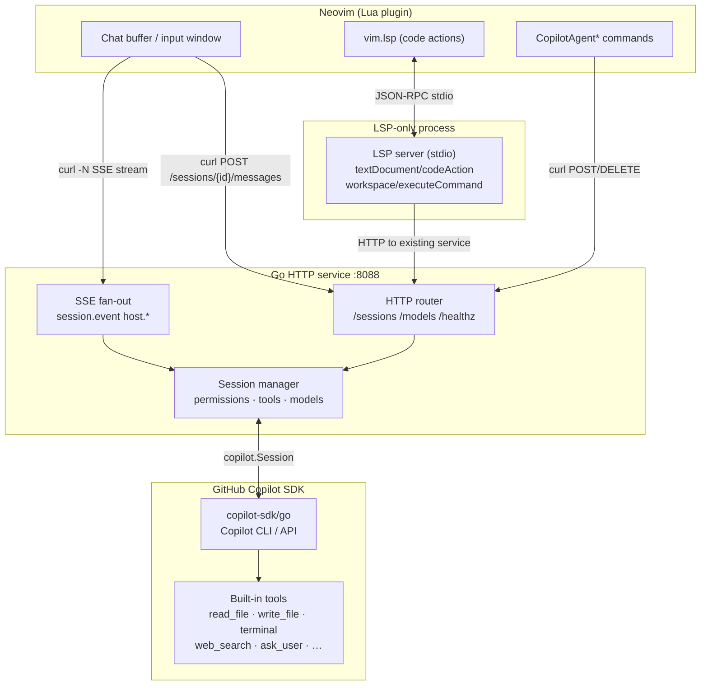

# copilot-agent.nvim

GitHub Copilot's agentic runtime, natively in Neovim. A lightweight Go bridge to the [official SDK](https://github.com/github/copilot-sdk) with native tool execution, four chat modes, session-aware permissions, persistent sessions, repository-local agent/skill discovery, and LSP code actions.

## Demo video

One minute video to create a terminal version of flappy bird:
<video src="https://gist.github.com/user-attachments/assets/5091ddcb-84f8-4c1a-b8a7-ea4bef6393f4" controls width="70%"></video>

## Key Capabilities

| Feature                       | Technical Highlight                                                         |
| :---------------------------- | :-------------------------------------------------------------------------- |
| **Autonomous SDK Loop**       | Native file I/O, terminal execution, and web search via official Go SDK.    |
| **State Rewind**              | Undo/Restore codebase and session to any previous conversation point.       |
| **Session Continuity**        | Resume sessions across Neovim, VS Code, and CLI with shared metadata.       |
| **LSP-Native**                | AI-driven 'Fix', 'Test', and 'Explain' via standard `code_action` triggers. |
| **Autopilot Modes**           | Four levels of oversight, from per-step approval to full autonomy.          |
| **Project Intelligence**      | Automatic discovery of `.github/agents` and `.github/skills` configs.       |
| **Integrate to nvim plugins** | review changes in Diffview; commit with fugitive and more                   |
| **Live Observability**        | Async statusline and streaming UI for sub-agent tracking and token usage.   |

---

### Agent Tool Loop

The agentic loop is what makes this plugin different from simple chat wrappers. The assistant doesn't just answer; it acts: reading files, fetching web pages, running commands, writing code, and iterating until the task is done.

## Architecture



The HTTP bridge and the LSP helper are separate processes. The HTTP service owns session state; `vim.lsp.start()` launches an LSP-only helper that talks to the already-running HTTP service. The Lua plugin communicates via `curl` shell-outs for all HTTP and SSE traffic.

---

## Comparison with Alternatives

### vs CopilotChat.nvim

[CopilotChat.nvim](https://github.com/CopilotC-Nvim/CopilotChat.nvim) calls the Copilot (or other) LLM REST APIs directly from Lua. It supports multiple providers but has no agent runtime of its own — tool execution and the agentic loop are implemented in Lua above the client.

<details>
<summary><strong>📂 Feature-by-feature comparison with CopilotChat.nvim</strong></summary>

| Feature                   | **copilot-agent.nvim**                                                | CopilotChat.nvim          |
| ------------------------- | --------------------------------------------------------------------- | ------------------------- |
| Backend                   | Official Copilot SDK (Go)                                             | Direct LLM REST API (Lua) |
| Agent / tool-use mode     | ✅ full agentic (file edits, terminal, web search, …)                 | ❌ chat only              |
| Chat modes                | ask · plan · **agent** · autopilot                                    | ask only                  |
| Permission management     | ✅ interactive / approve-reads / approve-all / autopilot / reject-all | ❌                        |
| Config discovery          | ✅ SDK-native (`.github/copilot-instructions.md`, etc.)               | ❌ manual                 |
| Custom agents / skills    | ✅ SDK-native, same as VS Code                                        | ❌                        |
| File & folder attachments | ✅ (buffer, selection, file, folder, image, clipboard paste)          | ✅ (buffer context❓ )    |
| Session persistence       | ✅ per working directory                                              | ❌                        |
| Model switching (live)    | ✅ mid-session switching                                              | ❓                        |
| LSP code actions          | ✅ (explain / fix / add tests / add docs)                             | ❌                        |
| MCP support               | ✅                                                                    | ❓                        |
| Multi-provider            | ❌ (Copilot only, or Bring your own key)                              | ✅ (provider_resolver)    |
| Dependencies              | codepilot-cli + go server                                             | Pure Lua                  |

The model picker shows each model's billing multiplier when the SDK provides one.

</details>

**When to choose CopilotChat.nvim**: zero-binary Lua setup, just want Copilot chat with buffer context, happy with a Lua-managed tool loop.

**When to choose copilot-agent.nvim**: you want the Copilot SDK owning the agent loop with native tools, permission control, and session persistence.

---

### vs ACP plugins (codecompanion.nvim, avante.nvim in ACP mode)

[**ACP (Agent Client Protocol)**](https://agentclientprotocol.com) lets a Neovim plugin act as a client to any external CLI agent. The plugin sends prompts and streams back results; the CLI agent owns the tool execution and agentic loop. Both codecompanion.nvim and avante.nvim support ACP.

`copilot-agent.nvim` is narrower in scope but deeper in Copilot integration: the Go service embeds the Copilot SDK directly, so it gets SDK-native features (config discovery, custom agents, skill directories, sub-agent streaming) that no ACP bridge can expose.

<details>
<summary><strong>📂 Feature-by-feature comparison with ACP-based plugins</strong></summary>

| Feature                       | **copilot-agent.nvim**                           | codecompanion.nvim                        | avante.nvim                            |
| ----------------------------- | ------------------------------------------------ | ----------------------------------------- | -------------------------------------- |
| Agent backend                 | Copilot SDK (Go, embedded)                       | ACP CLI agents or direct LLM adapters     | ACP CLI agents or direct LLM adapters  |
| ACP support                   | ❌ (no plan)                                     | ✅ (Claude Code, Codex, Copilot CLI, …)   | ✅ (Zen Mode)                          |
| Multi-provider / BYO API key  | ❌ (Copilot only)                                | ✅ (Anthropic, OpenAI, Gemini, Ollama, …) | ✅ (Claude, OpenAI, Gemini, Ollama, …) |
| Tool-call execution           | SDK built-ins (file, terminal, web, ask_user …)  | Lua tools + ACP agent tools               | Rust tools + ACP agent tools           |
| Sub-agent / streaming events  | ✅ SDK-native                                    | ❌                                        | ❌                                     |
| MCP, agents & skill discovery | ✅                                               | ❌                                        | ❌                                     |
| Permission management         | ✅ 4 modes, 5 permissions (e.g. plan+allow_read) | ❌                                        | ❌                                     |
| Session Persistence           | ✅ Deep session & checkpoint resume              | ❌                                        | ❌                                     |
| LSP code actions              | ✅ (explain / fix / add tests / add docs)        | ✅ (via prompt library)                   | ❌                                     |

</details>

**When to choose copilot-agent.nvim**: you're committed to GitHub Copilot and want the deepest possible SDK integration: native tools, permission management, session persistence, sub-agent events, and LSP code actions, without routing through an intermediate CLI.

---

## Prerequisites

- Go 1.24+ (only for building from source; pre-built binary skips this)
- `curl` on `PATH`
- GitHub Copilot CLI runtime (`@github/copilot/index.js`) or access via `-cli-url`
- Neovim 0.12+ (with native autocomplete and LSP setup)

**Optional:**

- [`delta`](https://github.com/dandavison/delta) — rich diff viewer for permission "Show diff" (auto side-by-side for wide windows; falls back to builtin if not installed)
- `pngpaste` / `wl-paste` / `xclip` — clipboard image paste
- snacks.picker / telescope / fzf-lua / mini.pick — fuzzy file picker

Run `:checkhealth copilot_agent` after installation to verify all requirements.

> [!NOTE]
> Seeing `service.command is empty — auto_start will not work` in `:checkhealth` can be a false warning when `service.command = nil` (runtime auto-detection). The plugin can still auto-detect `<plugin_root>/bin/copilot-agent` or fall back to `go run .` at runtime.

---

## Installation

### Step 1 — Download the pre-built binary (recommended)

Run this command inside Neovim after installing the plugin:

```
:CopilotAgentInstall
```

This downloads the correct binary for your platform from the
[latest GitHub release](https://github.com/ray-x/copilot-agent.nvim/releases/tag/latest)
and saves it to `<plugin_root>/bin/copilot-agent` (or `copilot-agent.exe` on Windows).
No Go toolchain required.

Supported platforms:

| Platform            | Binary                            |
| ------------------- | --------------------------------- |
| Linux x86_64        | `copilot-agent-linux-amd64`       |
| Linux aarch64       | `copilot-agent-linux-arm64`       |
| Windows x86_64      | `copilot-agent-windows-amd64.exe` |
| Windows aarch64     | `copilot-agent-windows-arm64.exe` |
| macOS Apple Silicon | `copilot-agent-darwin-arm64`      |

You can also download manually from the
[releases page](https://github.com/ray-x/copilot-agent.nvim/releases/tag/latest)
and place it anywhere; then set `service.command = { "/path/to/copilot-agent" }`.

On Windows, the plugin automatically switches its local control channel from a Unix socket to a loopback TCP listener, so you do not need MSYS2 just to make the service start.

### Step 2 — Plugin setup with lazy.nvim

For most users, this minimal setup is enough:

```lua
{
  "ray-x/copilot-agent.nvim",
  build = ":CopilotAgentInstall",
  opts = function()
    require("copilot_agent").setup({
      -- lsp = { enabled = true }, -- experimental if you want to start lsp, it will be a separate copilot-agent lsp process
    })
  end,
}
```

`service.auto_start` defaults to `true`. For backward compatibility, a top-level `auto_start = ...` in `setup()` is still accepted and mapped to `service.auto_start` unless you explicitly set `service.auto_start`.

<details>
<summary><strong>📂 Full setup example with common options</strong></summary>

```lua
{
  "ray-x/copilot-agent.nvim",
  build = ":CopilotAgentInstall",
  config = function()
    require("copilot_agent").setup({
      -- When auto_start=true the plugin connects to the shared Go service if
      -- one already exists, otherwise it starts exactly one and reads its
      -- port from stderr automatically. No manual base_url needed.
      base_url = "http://127.0.0.1:8088",  -- only for externally-started services
      client_name = "nvim-copilot",
      permission_mode = "approve-all",  -- "interactive" | "approve-all" | "autopilot" | "reject-all"
      auto_create_session = true,
      lsp = {
        enabled = true, -- start the helper LSP automatically from setup()
      },
      session = {
        working_directory = function() return vim.fn.getcwd() end,
        model = nil,    -- nil = Copilot picks a default
        agent = nil,    -- nil = "default"; or "coding", "gpt-4.1", a custom agent name
        streaming = true,
        enable_config_discovery = true,  -- respects .github/copilot-instructions.md etc.
        replay_permission_history = false,  -- false (default) skips permission replay on resume for faster session loads
        history_turn_limit = 256,       -- only replay the most recent N turns when opening a large session
        history_activity_turn_limit = 64, -- keep detailed activity only for the most recent N turns (<= history_turn_limit)
        history_preview_chars = 120,    -- truncation length for summarized historical activity/tool outputs
        auto_resume = "prompt",  -- "prompt" (default) | "auto" — when multiple sessions exist
      },
      service = {
        auto_start = true,
        -- command = nil means auto: uses <plugin_root>/bin/copilot-agent if present,
        -- otherwise falls back to { "go", "run", "." } (requires Go toolchain).
        command = nil,
        cwd = nil,                         -- defaults to <plugin_root>/server
        detach = true,                     -- default: reuse one detached background service across Neovim instances
        port_range = nil,                  -- e.g. "18000-19000" for fixed range
        log = {
          enabled = false,                 -- set true to enable Go service file logging
          path = nil,                     -- nil = stdpath("state") .. "/copilot-agent-service.log"
        },
        startup_timeout_ms = 15000,
        startup_poll_interval_ms = 250,
      },
      chat = {
        title = "Copilot Chat",
        system_notify_timeout = 3000,    -- ms before auto-clearing transient notices
        render_markdown = true,          -- set false to disable render-markdown.nvim (faster on long playbacks)
        protect_markdown_buffer = true,  -- upstream Neovim Treesitter workaround for the prompt buffer; set false to disable
        diff_cmd = { 'delta' },          -- external diff viewer; false = builtin float
        diff_review = true,              -- offer vimdiff after agent modifies a git-tracked file; clean buffers auto-reload, conflicting modified buffers prompt before reload
        activity_view = 'hover',         -- 'hover' (default) opens a read-only preview via K (or CursorHold when enabled); 'diff' opens editable file diffs on <CR>; 'raw' keeps the patch-text viewer
        activity_diff_tool = 'native',   -- 'native', 'diffview', 'fugitive', or a custom Vim command name
        -- Hover & preview controls:
        -- activity_hover_key: string (default: 'K') - key to toggle the read-only hover preview when activity_view='hover' while keeping focus in chat.
        -- activity_hover_focus_key: string (default: 'gK') - key to move focus into the current hover preview (opens it first if needed).
        -- activity_hover_cursor_hold: boolean (default: false) - when true, show hover on CursorHold/CursorHoldI instead of the hover key.
        -- activity_hover_timeout_ms: number (default: 2500) - auto-close timeout for hover preview in milliseconds (<=0 disables auto-close).
      },
      prompt = {
        style = "cold",                  -- "cold" (default) = red-violet/violet/blue, "warm" = red/yellow/green
      },
      compose = {
        width = 0.4,                     -- left split width; fraction of chat width, or absolute columns
        min_width = 40,
        max_width = 100,
        promote_keymap = "<leader>cc",   -- set false to disable the prompt-buffer promotion mapping
      },
      statusline = {
        enabled = false,                 -- default: keep plugin-owned chat/input local statuslines disabled
        components = {                   -- default: all true
          mode = true,
          permission = true,
          busy = true,
          session = true,
          model = true,
          tool = true,
          intent = true,
          context = true,
          config = true,
          attachments = true,
          help = true,
        },
      },
      notify = true,  -- set false to silence all [copilot-agent] vim.notify calls
      file_log_level = "WARN",  -- TRACE | DEBUG | INFO | WARN | ERROR; TRACE logs raw host/session payloads, DEBUG logs plugin actions and HTTP details to stdpath("log") .. "/copilot_agent.log"
      file_log_batch = {
        enabled = true,            -- queue file-log writes and flush in batches
        flush_interval_ms = 2000,  -- flush pending log lines at least every 2 seconds
        max_entries = 20,          -- flush immediately when queue reaches this size
      },
    })
    -- Start the combined HTTP + LSP service.
    -- Called automatically by CopilotAgentChat / CopilotAgentAsk if auto_start = true.
    -- Call explicitly here to get LSP code actions available immediately:
    require("copilot_agent").start_lsp()
  end,
}
```

`file_log_batch` controls buffered file logging behavior. Set `enabled = false` to restore immediate per-line writes.

`service.log.enabled` defaults to `false`. When enabled, `service.log.path` overrides the log file location; when `path` is `nil`, the default is `stdpath("state") .. "/copilot-agent-service.log"`.

</details>

<details>
<summary><strong>📂 Advanced service command and isolation examples</strong></summary>

If you want to point at a binary in a custom location:

```lua
-- Dynamic port (recommended for multiple nvim instances)
service = { auto_start = true, command = { "/path/to/copilot-agent" } }

-- Fixed port
service = { auto_start = true, command = { "/path/to/copilot-agent", "--addr", "127.0.0.1:8088" } }

-- Port range (first free port in 18000–19000)
service = { auto_start = true, command = { "/path/to/copilot-agent" }, port_range = "18000-19000" }
```

When the plugin starts the service on Windows, it appends a localhost control address automatically (`--control-addr 127.0.0.1:0`) unless you already provided `--control-addr` or `--control-socket` yourself. Keep `service.command` as a list/table so those flags can be added.

**Global service vs isolated instances**

By default, `auto_start = true` connects to the shared service if it is already running, otherwise it starts a single detached background service for your user account. In managed mode, the plugin first discovers the live HTTP address via the local control endpoint (`copilot-agent.sock` / `--control-addr`), then falls back to `stdpath("state") .. "/copilot-agent.addr"` only when that saved address still belongs to a live shared service. Session resume is still matched by `session.working_directory`, but the service process and persisted session catalog are global by default. On quit, the last Neovim instance now requests detached-service shutdown in the background so exit does not wait on a slow control socket.

The helper LSP reuses that same shared service; it does not spawn a separate Copilot backend.

If you want **per-project isolation**, pin a project-specific address and disable detaching:

```lua
require("copilot_agent").setup({
  base_url = "http://127.0.0.1:18121",
  session = {
    working_directory = function() return vim.fn.getcwd() end,
  },
  service = {
    auto_start = true,
    detach = false,
    port_range = "18121-18121",
  },
})
```

Reuse the same stable port when reopening the same project later. If you open multiple isolated projects at the same time, each one needs its own port.

</details>

---

## Running the Service Manually

See [server/README.md](server/README.md#running-the-service-manually) for manual startup, build flags, and service runtime details.

### Startup troubleshooting

- A `copilot-agent` binary alone is not enough: the GitHub Copilot CLI runtime must also be resolvable (`-cli-path`, environment, or `PATH`).
- GUI Neovim launches (Finder/Spotlight/app launchers) often have a different `PATH` than terminal shells. If startup fails there but works in terminal Neovim, set explicit paths in your config (`service.command`, service env vars, or CLI path env) and re-run `:checkhealth copilot_agent`.

---

## Commands

Use `:CopilotAgentDashboard` or `:CopilotAgentChat` to get started.

<details>
<summary><strong>📂 Full command reference</strong></summary>

| Command                              | Description                                                                                                                    |
| ------------------------------------ | ------------------------------------------------------------------------------------------------------------------------------ |
| `:CopilotAgentInstall`               | Download pre-built binary for the current platform                                                                             |
| `:CopilotAgentDashboard`             | Open the Copilot Agent startup dashboard                                                                                       |
| `:CopilotAgentChat [fullscreen]`     | Open the chat buffer; `fullscreen` opens in a new tab                                                                          |
| `:CopilotAgentChatToggle`            | Hide/show chat + input UI windows without reconnect/replay                                                                     |
| `:CopilotAgentChatFocus`             | Focus or switch to an open chat buffer                                                                                         |
| `:CopilotAgentAsk [prompt]`          | Send a prompt; no argument opens the input buffer                                                                              |
| `:CopilotAgentCompose [tab]`         | Open the compose scratch buffer; `tab` opens it in a new tab                                                                   |
| `:CopilotAgentPromoteToCompose`      | Move current prompt-buffer text into compose                                                                                   |
| `:CopilotAgentSendBuffer`            | Send the active compose buffer                                                                                                 |
| `:CopilotAgentNewSession`            | Disconnect current session and start a fresh one                                                                               |
| `:CopilotAgentSwitchSession`         | Pick from all persisted sessions and switch                                                                                    |
| `:CopilotAgentDeleteSession`         | Pick a session by summary + exact ID and delete it                                                                             |
| `:CopilotAgentModel [id]`            | Pick or set a model; tab-completes from service model list                                                                     |
| `:CopilotAgentStart`                 | Manually start the Go service                                                                                                  |
| `:CopilotAgentStop`                  | Disconnect the active session                                                                                                  |
| `:CopilotAgentStop!`                 | Delete the active session; checkpoint cleanup waits 7 days                                                                     |
| `:CopilotAgentCancel`                | Cancel the current agent turn                                                                                                  |
| `:CopilotAgentDiff`                  | Pick two checkpoints and open vimdiff for a changed file                                                                       |
| `:CopilotAgentFugitiveCommit [last]` | Generate a commit message and open fugitive commit; waits for final post-tool output; `last` reuses the latest assistant reply |
| `:CopilotAgentStatus`                | Show service URL, session id, stream status                                                                                    |
| `:CopilotAgentLsp`                   | Start (or reuse) the LSP client for code actions                                                                               |
| `:CopilotAgentPasteImage`            | Paste clipboard image as attachment                                                                                            |
| `:CopilotAgentRetryInput`            | Re-show the last dismissed ask_user prompt                                                                                     |

</details>

---

## Input Buffer

Open with `:CopilotAgentChat`, then press `i` or `<Enter>` in the chat buffer.

### Keybindings

| Key                               | Action                                                                                                  |
| --------------------------------- | ------------------------------------------------------------------------------------------------------- |
| `<CR>` / `<C-s>`                  | Send message                                                                                            |
| `q` / `<Esc>`                     | Close input (normal mode)                                                                               |
| `<C-t>`                           | Cycle chat mode: **💬 ask → 📋 plan → 🤖 agent → 🚀 autopilot**                                         |
| `<M-m>`                           | Open model picker                                                                                       |
| `<M-a>`                           | Cycle permission mode: **🔐 interactive → 📂 approve-reads → ✅ approve-all → 🤖 autopilot**            |
| `<C-a>`                           | Attach resource — opens picker menu (see below)                                                         |
| `<M-v>`                           | Paste image from clipboard as attachment                                                                |
| `<C-x>`                           | Toggle session tools (enable/disable individual tools)                                                  |
| `<Tab>`                           | Trigger completion (`@file` or `/command`)                                                              |
| `<C-e>`                           | Dismiss the active completion popup                                                                     |
| `@<path>` / `@"path with spaces"` | Attach a file by path or open buffer (autocomplete from working directory and named open buffers)       |
| `/<cmd>`                          | Run a built-in slash command (autocomplete with `<Tab>`)                                                |
| `<C-w>` (insert)                  | Delete previous word in the prompt while keeping the mode prefix (`ask❯❯❯`/`plan❯❯❯`/`agent❯❯❯`) intact |
| `<C-u>` (insert)                  | Delete from prompt start to cursor while keeping the mode prefix (`ask❯❯❯`/`plan❯❯❯`/`agent❯❯❯`) intact |
| `<C-p>` / `<M-p>`                 | Previous prompt from history                                                                            |
| `<C-n>` / `<M-n>`                 | Next prompt from history                                                                                |
| `<C-c>` (output)                  | Cancel current turn                                                                                     |
| `zA` (output)                     | Toggle collapsed `Activity:` transcript blocks                                                          |
| `<CR>` (output)                   | On Activity lines, open the editable diff split; otherwise open input                                   |
| `K` (output)                      | Toggle the read-only Activity hover preview while keeping focus in chat                                 |
| `gK` (output)                     | Move focus into the current Activity hover preview (opens it first if needed)                           |
| `<C-w>j` (output)                 | Move into Activity hover preview when available; otherwise fallback to normal window-down (`<C-w>j`)    |
| `CursorHold` / `CursorHoldI`      | When `activity_hover_cursor_hold=true`, show the concise read-only hover preview on Activity lines      |
| `[[` / `]]` (output)              | Jump to previous/next conversation (`User:` block)                                                      |
| `[a` / `]a` (output)              | Jump to previous/next `Assistant:` or `Activity:` block                                                 |
| `gT` (normal)                     | Open TODO float for the current turn                                                                    |
| `g?` (normal)                     | Show help float with keybindings, session commands, and recovery tips                                   |

### Slash Commands

The input buffer supports built-in slash commands handled by the plugin before the text is sent as a normal Copilot prompt. Type `/` and press `<Tab>` to browse and complete the available commands. Press `<C-e>` while the popup is open to dismiss it without accepting a candidate. Some of the commands are still experimental.

`/agent` completion is optimized for inline prompting: selecting an agent suggestion inserts the agent name without the `/agent` prefix, so `/agent Git Commit Agent` completion becomes `Git Commit Agent`.

<details>
<summary><strong>📂 Supported slash commands</strong></summary>

| Command                | Arguments                                                              | What it does                                                                                                                                                                                                                                                                                 |
| ---------------------- | ---------------------------------------------------------------------- | -------------------------------------------------------------------------------------------------------------------------------------------------------------------------------------------------------------------------------------------------------------------------------------------- |
| `/add-dir`             | `[path]`                                                               | Add a directory to the session's allowed-directory list; prompts if omitted                                                                                                                                                                                                                  |
| `/agent`               | `[name\|default\|clear]`                                               | Pick a discovered custom agent, or reset back to the default agent                                                                                                                                                                                                                           |
| `/allow-all`           | —                                                                      | Switch permission mode to `approve-all`                                                                                                                                                                                                                                                      |
| `/ask`                 | `[question]`                                                           | Ask a side question in a temporary read-only session and show the answer separately                                                                                                                                                                                                          |
| `/clear`               | —                                                                      | Clear the current conversation and start a fresh session                                                                                                                                                                                                                                     |
| `/compact`             | —                                                                      | Compact session history and refresh context usage                                                                                                                                                                                                                                            |
| `/context`             | —                                                                      | Show current context-window token usage plus the latest quota and usage snapshot                                                                                                                                                                                                             |
| `/cwd`                 | `[path]`                                                               | Show or change the working directory used for future session actions                                                                                                                                                                                                                         |
| `/diff`                | `[vNNN\|from to\|from..to] [--difftool [name]]`                        | Show a checkpoint diff summary (default shows latest checkpoint changes), or open a visual diff via `--difftool` (`CodeDiff`, `Fugitive`, or native vim diff when no name is provided)                                                                                                       |
| `/env`                 | —                                                                      | Show the current environment, service, session, model, and mode snapshot                                                                                                                                                                                                                     |
| `/fleet`               | `[prompt]`                                                             | Start fleet mode for the active session                                                                                                                                                                                                                                                      |
| `/init`                | `[args]`                                                               | Run the project initialization helper                                                                                                                                                                                                                                                        |
| `/instructions`        | `[name]`                                                               | Open a discovered instructions file from the repository                                                                                                                                                                                                                                      |
| `/list-dir`            | —                                                                      | List allowed directories for the current session                                                                                                                                                                                                                                             |
| `/list-dirs`           | —                                                                      | Alias for `/list-dir`                                                                                                                                                                                                                                                                        |
| `/list-tools`          | —                                                                      | List remembered tool approvals for the current session; if empty, explain that the backend does not expose a full available-tools inventory                                                                                                                                                  |
| `/lsp`                 | `[create\|status\|show\|test\|help]`                                   | Bootstrap or inspect project LSP config for Copilot CLI                                                                                                                                                                                                                                      |
| `/mcp`                 | `[add\|show\|edit\|delete\|disable\|enable\|reload] ...`               | Manage MCP servers in `.mcp.json`, `.vscode/mcp.json`, and `~/.copilot/mcp-config.json` (global): add/show/edit/delete entries, toggle disabled state, and reconnect the active session to reload discovery                                                                                  |
| `/model`               | `[id]`                                                                 | Pick or switch the active model                                                                                                                                                                                                                                                              |
| `/new`                 | —                                                                      | Start a fresh session                                                                                                                                                                                                                                                                        |
| `/plan`                | `[draft text]`                                                         | Switch the input buffer to plan mode and optionally prefill the prompt                                                                                                                                                                                                                       |
| `/rename`              | `[name]`                                                               | Rename the active session                                                                                                                                                                                                                                                                    |
| `/research`            | `[topic]`                                                              | Send a research-oriented prompt that can use GitHub and web sources                                                                                                                                                                                                                          |
| `/reset-allowed-tools` | —                                                                      | Clear remembered tool approvals for the current session                                                                                                                                                                                                                                      |
| `/resume`              | `[session-id]`                                                         | Resume or switch to another saved session; prompts if omitted                                                                                                                                                                                                                                |
| `/review`              | `[focus]`                                                              | Ask Copilot to review the current changes, optionally with extra focus text                                                                                                                                                                                                                  |
| `/rewind`              | `[checkpoint]`                                                         | Rewind the session to a checkpoint such as `v003`, then queue the target git hash and reverted checkpoint summaries into the next Copilot prompt                                                                                                                                             |
| `/search`              | `[text]`                                                               | Search the current transcript and jump to a matching entry                                                                                                                                                                                                                                   |
| `/session`             | `[info\|checkpoints\|files\|plan\|rename\|cleanup\|prune\|delete] ...` | Inspect and manage sessions; bare `/session` still opens the switch picker. `/session prune --older-than <days> [--dry-run] [--include-named]` prunes old saved sessions, and `/session prune --keep-last <count> [--session <id>] [--dry-run]` trims old checkpoint snapshots for a session |
| `/share`               | `[markdown\|html] [path]`                                              | Export the current transcript as Markdown or HTML                                                                                                                                                                                                                                            |
| `/skills`              | `[name]`                                                               | Open a discovered skill from the repository                                                                                                                                                                                                                                                  |
| `/tasks`               | `[filter]`                                                             | Show background task and sub-agent activity                                                                                                                                                                                                                                                  |
| `/undo`                | —                                                                      | Restore the latest checkpoint for the current session, then queue the restore git hash/context into the next Copilot prompt                                                                                                                                                                  |
| `/usage`               | —                                                                      | Show detailed session usage, quota snapshot, discovery counts, and context-window stats                                                                                                                                                                                                      |

</details>

## Compose Buffer

Open with `:CopilotAgentCompose` to open it as a left-side split next to chat output, or `:CopilotAgentCompose tab` to edit in a new tab.

The compose buffer is a separate markdown scratch buffer for long prompts. It keeps the same `@` attachment and slash-command completion as the normal input buffer. From the prompt buffer, press `<leader>cc` or run `:CopilotAgentPromoteToCompose` to promote the current prompt into compose and continue editing there. Customize or disable the mapping with `compose.promote_keymap`.

| Key / Command                   | Action                           |
| ------------------------------- | -------------------------------- |
| `<leader>cc` (prompt buffer)    | Move current prompt into compose |
| `:CopilotAgentPromoteToCompose` | Move current prompt into compose |
| `<leader>cs` / `<C-s>`          | Send compose buffer              |
| `:w` / `:wq`                    | Send compose buffer              |
| `:CopilotAgentSendBuffer`       | Send compose buffer              |
| `q` / `<Esc>`                   | Close compose buffer             |

### Attaching Files and Images

Press `<C-a>` in the input buffer to open the resource picker:

| Choice                     | What it does                                                   |
| -------------------------- | -------------------------------------------------------------- |
| Current buffer             | Attaches the previously focused file buffer                    |
| Visual selection           | Attaches the last visual selection with file path + line range |
| File                       | Opens fuzzy picker → select one or more files (multi-select)   |
| Folder                     | Opens fuzzy picker / `vim.ui.input` to pick a directory        |
| Instructions file          | Same as File but marked as an instructions context file (📋)   |
| Image file                 | Opens fuzzy picker to select an image (png/jpg/gif/…)          |
| Paste image from clipboard | Saves clipboard image to a temp PNG and attaches it (🖼️)       |

`<M-v>` is a direct shortcut for **Paste image from clipboard** without opening the menu.
`:CopilotAgentPasteImage` is the equivalent command.

Pending attachments appear in the input statusline as `📎 N`. Each attachment is also shown below the prompt text in the chat buffer once sent.

#### Fuzzy Picker Integration

The File / Folder / Image / Instructions choices auto-detect and use the best available picker — no extra configuration needed:

| Priority | Picker            | Notes                                                  |
| -------- | ----------------- | ------------------------------------------------------ |
| 1        | **snacks.picker** | `snacks.picker.files` / `snacks.picker.directories`    |
| 2        | **telescope**     | `find_files`; `telescope-file-browser` for directories |
| 3        | **fzf-lua**       | `fzf.files`; `fzf_exec fd --type d` for directories    |
| 4        | **mini.pick**     | `mp.builtin.files` (files only)                        |
| 5        | **vim.ui.input**  | Fallback — type the path with completion               |

Override the picker or force the native fallback via config:

```lua
chat = { file_picker = 'auto' }       -- default: detect best available
chat = { file_picker = 'telescope' }  -- always use telescope
chat = { file_picker = 'fzf-lua' }    -- always use fzf-lua
chat = { file_picker = 'native' }     -- always use vim.ui.input
```

#### Clipboard Image Requirements

| Platform      | Tool required     | Install                         |
| ------------- | ----------------- | ------------------------------- |
| macOS         | `pngpaste`        | `brew install pngpaste`         |
| Linux/Wayland | `wl-paste`        | `sudo apt install wl-clipboard` |
| Linux/X11     | `xclip` or `xsel` | `sudo apt install xclip`        |

### Chat Modes

Cycled with `<C-t>` in the chat/input buffer. The mode is shown in the statusline.

| Mode          | Icon | SDK session mode | Description                                                                                                                                                                                                                             |
| ------------- | ---- | ---------------- | --------------------------------------------------------------------------------------------------------------------------------------------------------------------------------------------------------------------------------------- |
| **ask**       | 💬   | `interactive`    | Single-turn Q&A. The model answers once and stops. Tools are available but each call requires approval. Use for questions, explanations, and code reviews.                                                                              |
| **plan**      | 📋   | `plan`           | Like ask, but the model is guided to produce a structured implementation plan before taking any action. Good for scoping a task before committing to it.                                                                                |
| **agent**     | 🤖   | `autopilot`      | Multi-step agentic loop. The model calls tools (read files, run commands, write code) repeatedly and iterates until the task is done. Pauses to prompt you before writes/shell commands. Read access to the workspace is auto-approved. |
| **autopilot** | 🚀   | `autopilot`      | Same agentic loop as agent, but with `approve-all` permission — every tool call (reads _and_ writes) is silently approved. Fully autonomous.                                                                                            |

**SDK note:** The Copilot SDK has three session modes — `interactive`, `plan`, and `autopilot`. VS Code's four-label model maps exactly onto these: ask → `interactive`, plan → `plan`, agent and autopilot both → `autopilot` (the difference is the permission mode, not the SDK mode).

### Performance Tips

- **render-markdown.nvim** integrates automatically when installed. On very long responses it can cause visible lag. Disable with `chat = { render_markdown = false }` to use treesitter highlighting only (much faster).
- **Streaming** is enabled by default (`session.streaming = true`). The chat buffer updates incrementally as tokens arrive.
- **Permission history replay** is filtered by default (`session.replay_permission_history = false`) so large sessions resume faster. Set it to `true` if you want to review historical permission requests/completions in the restored chat transcript.
- **Large-session replay window** defaults to the latest 256 turns (`session.history_turn_limit`) and keeps full activity detail only for the latest 64 turns (`session.history_activity_turn_limit`). Older replayed turns keep full assistant messages, while activity/tool outputs are summarized with previews capped by `session.history_preview_chars` (default 120).
- **Usage telemetry** (`assistant.usage`) updates statusline/context snapshots silently instead of adding extra `Activity:` transcript blocks. Use `/context` or `/usage` for full usage details.
- **Session resume**: with 1 matching session it resumes silently; with multiple sessions `auto_resume = "prompt"` (default) shows a picker titled with the current project name and path so you can choose which session to continue.

### Permission Modes

Cycled with `<M-a>` in the input buffer, or set via config / `POST /sessions/{id}/permission-mode`.
Each chat mode sets a sensible default permission automatically; `<M-a>` overrides it for the current mode.

| Icon | Mode              | Behaviour                                                                                                           |
| ---- | ----------------- | ------------------------------------------------------------------------------------------------------------------- |
| 🔐   | **interactive**   | Neovim prompts `Allow / Deny` for every tool call                                                                   |
| 📂   | **approve-reads** | Workspace read-file requests are auto-approved; writes and shell commands still prompt. Default for **agent** mode. |
| ✅   | **approve-all**   | All tool calls silently approved. Default for **autopilot** mode.                                                   |
| 🤖   | **autopilot**     | Approve all + auto-answer any `ask_user` questions (fully autonomous)                                               |
| 🚫   | **reject-all**    | Reject all tool calls (safe read-only mode)                                                                         |

#### `ask_user` requests — when will Copilot ask you a question?

There are **two separate interruption points** in an agentic loop:

1. **Tool-call approval** — before the SDK executes a tool (read file, run shell, write code, etc.).
   Controlled entirely by the permission mode above.

2. **`ask_user` requests** — the _model itself_ decides to pause and ask you a clarifying question
   mid-task (e.g. "Which branch should I target?" or "There are two test files — which one?").
   This is independent of tool approval and happens at the model's discretion.

| Permission mode   | Tool calls          | `ask_user` questions                       |
| ----------------- | ------------------- | ------------------------------------------ |
| **interactive**   | prompt every call   | shown via `vim.ui.input/select`            |
| **approve-reads** | prompt writes/shell | shown via `vim.ui.input/select`            |
| **approve-all**   | silent              | shown via `vim.ui.input/select`            |
| **autopilot**     | silent              | **auto-answered** (first choice, silently) |
| **reject-all**    | all rejected        | shown via `vim.ui.input/select`            |

> **Practical rule:** use **agent** mode (`approve-reads`) for day-to-day tasks — Copilot will still
> ask you clarifying questions but won't prompt for every file read. Switch to **autopilot** permission
> only when you are confident in the task scope and want zero interruptions.

---

## LSP Code Actions

The Go binary runs an LSP server on stdio. `:CopilotAgentLsp` or `require("copilot_agent").start_lsp()` now starts an LSP-only process that reuses the existing HTTP service instead of spawning a fresh backend session.

This helper server is separate from the project language servers used by Copilot CLI for code intelligence. Use `/lsp create` to bootstrap `.github/lsp.json` from active Neovim project LSP clients, then restart the Copilot service so config discovery reloads it.

Available code actions (triggered on any selection via `vim.lsp.buf.code_action()`):

- **Explain selection** — Ask Copilot to explain the selected code
- **Fix selection** — Ask Copilot to suggest a fix
- **Add tests for selection** — Generate unit tests
- **Add docs for selection** — Generate documentation

The action builds a prompt from the selected text, file path, and line range, then POSTs it to the active HTTP session.

---

## Statusline

Expose Copilot state in your statusline. Each function returns a short string.

By default, plugin-managed chat/input local statuslines are disabled (`statusline.enabled = false`), so you can keep your own statusline setup unchanged.

If you want plugin-managed local statuslines in Copilot windows, enable them explicitly:

```lua
require("copilot_agent").setup({
  statusline = {
    enabled = true,
  },
})
```

You can choose which components are rendered with `statusline.components` (default: all enabled). Supported component keys are: `mode`, `permission`, `busy`, `session`, `model`, `tool`, `intent`, `context`, `config`, `attachments`, `help`.

```lua
require("copilot_agent").setup({
  statusline = {
    enabled = true,
    components = {
      mode = true,
      busy = true,
      session = true,
      permission = false,
      model = false,
      tool = false,
      intent = false,
      context = false,
      config = false,
      attachments = false,
      help = false,
    },
  },
})
```

When enabled, default examples:

```text
input window
🤖agent (loop·approve-all)  ✅approve-all  ✅ready  default  󱃕 Instruction: 0  󱜙 Agent: 0 󱨚 Skill: 0  MCP: 0  (g? for help)

chat window
🤖agent (loop·approve-all)  ✅approve-all  ✅ready  default  󱃕 Instruction: 0 󱜙 Agent: 0 󱨚 Skill: 0  MCP: 0  session: [#project name 20260501 0905]
```

As the session becomes active, the statusline updates live with readiness (`⏳working`, `📝sync`, `🧩2 tasks`, `❓input`, `✅ready`), the current tool/intent, context tokens, quota remaining from `assistant.usage` events, pending attachments, and the active session label.

### Use statusline API

```lua
-- lualine
require("lualine").setup {
  sections = {
    lualine_x = {
      require("copilot_agent").statusline_mode,        -- [ask] / [plan] / [agent] / [autopilot]
      require("copilot_agent").statusline_model,       -- claude-sonnet-4.6 / default
      require("copilot_agent").statusline_busy,        -- ✅ready / ⏳working / 📝sync / 🧩2 tasks / ❓input
      require("copilot_agent").statusline_permission,  -- 🔐interactive / ✅approve-all / 🤖autopilot
      require("copilot_agent").statusline_attachments, -- 📎3 (when attachments pending)
      require("copilot_agent").statusline_tool,        -- 🔧 read_file (active tool)
      require("copilot_agent").statusline_intent,      -- current agent intent
      require("copilot_agent").statusline_context,     -- 12k/200k plus quota remaining when available
    }
  }
}

-- heirline / &statusline
-- %{v:lua.require'copilot_agent'.statusline()}
```

---

## Session Persistence

Session resume is scoped per project by `working_directory`: `pick_or_create_session` filters persisted sessions by working directory, so opening a different project starts a fresh session. The auto-started service itself is still global by default, which is why the startup picker now shows the current project name and path explicitly. Use `:CopilotAgentNewSession` to force a new one in the same directory, `:CopilotAgentSwitchSession` to pick from all persisted sessions across projects, or `:CopilotAgentDeleteSession` to remove one from a newest-first picker that includes the exact session ID and marks the active session with `●`.

Sessions are auto-named by the SDK after the first conversation turn. You can rename a session by typing `/rename My Session Name` in the input buffer.

When a session is deleted, its checkpoint git worktree is soft-deleted instead of being removed immediately. This applies both to `:CopilotAgentDeleteSession` and `:CopilotAgentStop!`. The checkpoint metadata records the deletion time and the worktree is pruned automatically after 7 days on the next plugin startup or checkpoint/session lifecycle operation.

When plugin-managed statuslines are enabled, the chat/output statusline shows the active session summary together with its short session ID, and transcript separators between turns render the completed-turn checkpoint label (`v001`, `v002`, ...) as a virtual rule so you can copy it for rewind/recovery workflows without opening the input buffer.

**Session selection behaviour:**

| Matching sessions for project          | Behaviour                                                         |
| -------------------------------------- | ----------------------------------------------------------------- |
| 0                                      | Creates a new session automatically                               |
| 1                                      | Resumes it silently — no prompt                                   |
| 2+ (`auto_resume = 'prompt'`, default) | Shows `vim.ui.select` picker; most recent session is listed first |
| 2+ (`auto_resume = 'auto'`)            | Silently resumes the most recent session                          |

To always skip the picker, set in your config:

```lua
session = { auto_resume = 'auto' }
```

---

## HTTP API Reference

See [server/README.md](server/README.md#http-api-reference) for the full endpoint list, session permission modes, and SSE event reference.

---

## Tutorial

1. 📖 **[Build a To-Do App with Copilot Agent](doc/tutorial-flask.md)** — Full-stack to-do list app with a REST API and responsive UI.
2. 🌤️ **[Build a Weather Dashboard with Copilot Agent](doc/tutorial-weather-dashboard.md)** — Glassmorphism weather app with wttr.in data, animated UI, and backend tests.
3. 🧩 **[Build a Weather Dashboard with Preset Copilot Agents](doc/tutorial-custom-agent-weather.md)** — Copy a ready-made `.github/agents/` pack and use separate UI, Python, and QA specialists.
4. 🐦 **[Build a Terminal Flappy Bird with Custom Agents and Skills](doc/tutorial-flappy-bird-go.md)** — Bootstrap a repo with script-copied prompts/agents/skills, implement a Go terminal game, and run `go vet`/`go test` before launching from Neovim terminal.

---

## Included repo-local custom agents

- **Go Quality Engineer** — runs the repository's existing Go quality checks
- **Selene Lua Quality Engineer** — runs Selene against the Lua sources
- **Code Review Engineer** — reviews Lua and Go changes for correctness, code quality, performance, and security
- **Git Commit Agent** — inspects git status, runs repo-appropriate pre-commit checks, and prepares commit messages from the staged diff
- **Document Update Agent** — reviews user-facing docs against recent plugin changes and updates commands, keymaps, changelog notes, and gotchas

Customize the commit agent's default checks and feedback rules in `.github/commit-agent.md`.

---

## Development

### Formatting

The project uses `make` targets for formatting. Run from the repo root:

```bash
make fmt        # format everything (Lua + Go)
make fmt-lua    # Lua only  — stylua lua/ plugin/  (config: stylua.toml)
make fmt-go     # Go only   — gofmt -w ./server
```

Requirements: [`stylua`](https://github.com/JohnnyMorganz/StyLua) and `gofmt` (bundled with Go).

CI enforces both formatters on every push — PRs with unformatted code will fail the **Lint** workflow.

## Testing

```bash
# Lua unit tests (no Neovim required)
busted --lpath='lua/?.lua;lua/?/init.lua' tests/unit/

# Neovim integration tests (requires nvim on PATH)
nvim --headless -u tests/minimal_init.lua \
  -c "PlenaryBustedFile tests/integration/setup_spec.lua"
```

CI runs all of the above automatically on push and PR via GitHub Actions.
